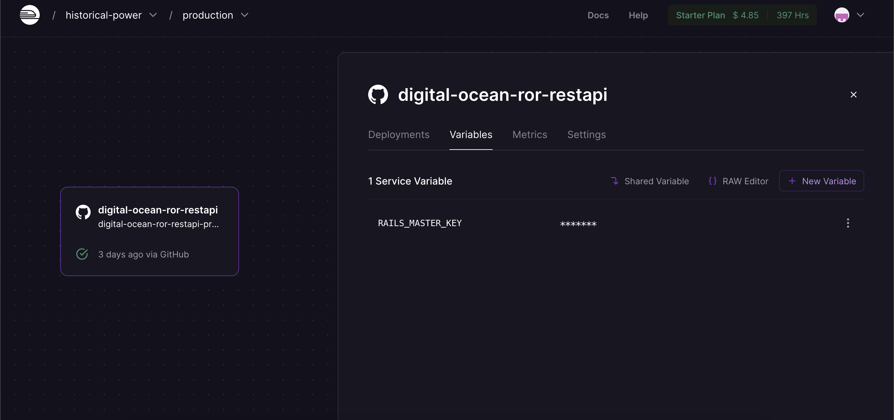

# Digital Ocean - Build a RESTful JSON API With Rails 5

## Introduction

This document presents a project created as part of the **"Digital Ocean - Build a RESTful JSON API With Rails 5"** tutorial series by Austin Kabiru, available on DigitalOcean (the series links: [part-one](https://www.digitalocean.com/community/tutorials/build-a-restful-json-api-with-rails-5-part-one), [part-two](https://www.digitalocean.com/community/tutorials/build-a-restful-json-api-with-rails-5-part-two), [part-three](https://www.digitalocean.com/community/tutorials/build-a-restful-json-api-with-rails-5-part-three)). The project consists of a **RESTful API** application that enables users to create and manage personal **todo lists** efficiently.

The project utilizes the **API-only** version of the **Ruby on Rails (RoR)** framework as the foundation for the API. It also incorporates the **RSpec** framework for custom testing, ensuring the reliability and accuracy of the application. The project's specifications are as follows (further details can be found in the included **'Gemfile'**):
- Language: [Ruby 2.5.9](https://www.ruby-lang.org/en/news/2021/04/05/ruby-2-5-9-released/) 
- API Framework: [Rails 6.1.7](https://rubyonrails.org/)
- Database: [Sqlite3 1.4](https://sqlite.org/index.html)
- Testing: [RSpec 4.0](https://github.com/rspec/rspec-rails)
- Authentication: [JWT 2.7.0](https://github.com/jwt/ruby-jwt)

### API Framework Overview

The project employs the **Ruby on Rails** framework, a well-known web application framework, to streamline development processes. Specifically, the **API-only version** of RoR is utilized to eliminate unnecessary components unrelated to a RESTful API, such as generating view files.

### Data Flow

The data flow within the application begins with **user authentication** using the token-based JWT method. Upon successful authentication, the process proceeds to subsequent stages of an **individual route handler**. In case of invalid authentication, an exception is raised and handled by a **custom exception handler**. This authentication process is applied to most APIs, excluding user login and registration APIs.

All available APIs interact with the **database** to retrieve, store, update, and delete data before reponding to requests. When storing new data (excluding user data), it is **associated** with the current authenticated user. A comprehensive list of available APIs can be found in this [Postman collection](https://elements.getpostman.com/redirect?entityId=12961186-5e107c51-c5a2-44e0-bfed-30034bd1e03a&entityType=collection).

### Project Structure

The project follows the **default structure** provided by the Ruby on Rails framework, with additional custom folders for testing purposes. The following folders are of particular importance:
- **'/app/controllers'**: This folder contains the **routing** implementation. The routes are **versioned** using the **'V1'** and **'V2'** subfolders (though in this case, the full APIs are only provided for the V1 version). The **'concerns'** folder includes **helper functions** for exception handling and responding to requests with JSON data.
- **'/app/auth'**: This folder contains the **authentication** implementation, including **user authentication** using IDs and passwords, as well as **user validation** based on the provided JWT token.
- **'/spec'**: This folder contains the **test** implementations. The **'auth'**, **'controllers'**, and **'requests'** subfolders contain **test cases** for authentication, pre-request/middleware handling, and request handling for each API. The **'models'** folder ensures the appropriate **format of models** used in the tests.
- **'/config'**: This folder stores **configuration** data, including database connection settings, routing maps, and environment variables for different deployment stages.

### Models and Database

The project utilizes the **SQLite3** database engine, with the database file located in the **'db'** folder. The schema includes three tables: **todos**, **items**, and **users**. The database design corresponding to these tables is illustrated below:  

### Testing

The **RSpec** framework is employed to implement a **test-driven development (TDD)** approach in the project. All test cases and testing configurations are located in the **'spec'** folder. To ensure consistent testing environments, the **database cleaner** and **factory bot** libraries are used to recreate and populate the database. Additionally, the **Faker** library generates realistic dummy data for the database.

### Deployment

The production application is hosted on **Railway** (link: [deployed app](https://digital-ocean-ror-restapi-production.up.railway.app/)). The project's source code is **integrated** with Railway App via **GitHub**, allowing automatic deployment whenever changes are pushed to the source code repository. Notably, the deployment process involves **recreating** the project's database. **Dockerfile** is employed for Railway to build the project. The Railway configuration can be found in **'railway.json'**, and the **'Dockerfile'** file specifies the build process. Furthermore, a **custom environment variable** is added in Railway to specify the project's master key without including the master.key file in the source code.
  

### Conclusion

In conclusion, this documentation provides an overview of the API, data flow, project structure, models and database, as well as testing and deployment aspects of the project developed to complete the "Digital Ocean - Build a RESTful JSON API With Rails 5" tutorial series.

The tutorial series offers valuable insights into building RESTful API applications using the Ruby on Rails framework. It provides a deeper understanding of database management, routing implementation, and folder structure within the framework. I believe this series serves as an excellent resource for anyone aspiring to become a backend engineer proficient in Ruby on Rails.