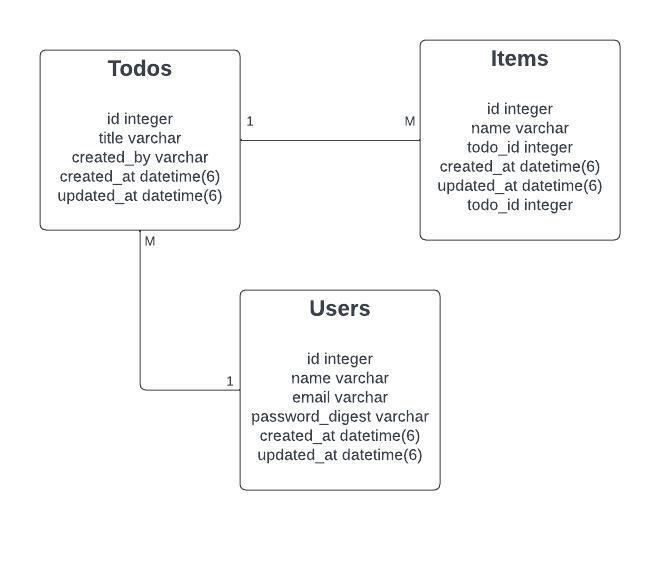

# Digital Ocean - Build a RESTful JSON API With Rails 5

Welcome to my repository showcasing the culmination of my work on following the "Build a RESTful JSON API With Rails 5" tutorial series by Austin Kabiru, available on DigitalOcean. This tutorial is divided into three comprehensive parts.

In the [first part](https://www.digitalocean.com/community/tutorials/build-a-restful-json-api-with-rails-5-part-one), the focus lies on setting up a Rails project using a Test-Driven Development (TDD) approach. The tutorial demonstrates the utilization of the RSpec testing framework, along with supporting frameworks like Factory Bot, Database Cleaner, Shoulda Matchers, and Faker.

The [second part]((https://www.digitalocean.com/community/tutorials/build-a-restful-json-api-with-rails-5-part-one)) delves into the implementation of token-based authentication using JWT (JSON Web Tokens). This section provides valuable insights into securing API endpoints and managing user authentication.

Lastly, the [third part](https://www.digitalocean.com/community/tutorials/build-a-restful-json-api-with-rails-5-part-one) encompasses essential topics such as versioning, serializers, and pagination. By incorporating these concepts, the tutorial equips developers with the necessary knowledge to enhance the functionality and scalability of their Rails projects.

## What's in this Repository?

This repository contains the Rails app I made to complete the tutorial series. The specs of the app can be seen below:
- Language: [Ruby 2.5.9](https://www.ruby-lang.org/en/news/2021/04/05/ruby-2-5-9-released/)
- API: [Rails](https://rubyonrails.org/)
- DB: [Sqlite3](https://sqlite.org/index.html)
- Testing: [Rspec] (https://github.com/rspec/rspec-rails)
- Authentication: [JWT] (https://github.com/jwt/ruby-jwt)

### Additional Resources

Here are some additional resources to help you understand more about the app contained in this repository:

- You can visit the [Railway app](https://digital-ocean-ror-restapi-production.up.railway.app/) I have created to see the sample of the production deployment.

- Use this [Postman collection](https://elements.getpostman.com/redirect?entityId=12961186-5e107c51-c5a2-44e0-bfed-30034bd1e03a&entityType=collection) to test the API (I also have included the [exported file](Digital Ocean RoR RestAPI.postman_collection)).

- The below image is the database design of the models created throughout the series.
  

### Conclusion
In conclusion, this tutorial series has provided me with valuable insights into building a REST API application using the Ruby on Rails framework, giving me a deeper understanding of its internal database management, routing implementation, and folder structure. The series also introduced me to useful packages and best practices that might be crucial for developing Rails applications effectively. Moreover, the TDD (Test-Driven Development) part is quite new to me, and the series explained it pretty well, providing me with a more robust understanding and an idea to implement it. Overall, this series serves as an excellent resource for anyone embarking on a journey as a backend engineer with Ruby on Rails.
 